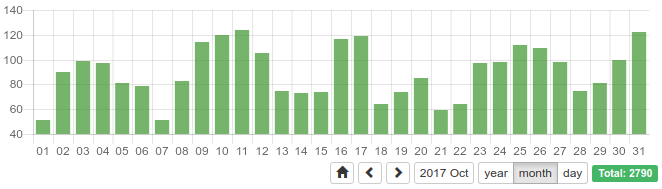

yii2-stats-widget
========================

Visualizes time series data from your application.
Package consists of two parts.
 
- **Interactive stats widget** based on charts.js library. Widget features are: different date ranges browsing, 
changing data group interval. 
- **Data providers and formatters** wich read and adapt data of your application for the stats widget.


Installation
---

`composer require pavlm/yii2-stats-widget`

Usage
---

### 1. Setup StatsAction
Add action to some controller. Configure time series provider.

```php
    public function actions()
    {
        return [
            'stats-users' => [
                'class' => StatsAction::class,
                'providerFactory' => new TimeSeriesProviderCallbackFactory(function ($rangeStart, $rangeEnd, $periodInterval, $timeZone) {
                    return new QueryStatsProvider([
                        'rangeStart' => $rangeStart,
                        'rangeEnd' => $rangeEnd,
                        'periodInterval' => $periodInterval,
                        'timeZone' => $timeZone,
                        'timeZoneConnection' => new \DateTimeZone('Europe/Moscow'),
                        'query' => (new Query())->from('user'),
                        'dateField' => 'created_at',
                        'dateFieldType' => QueryStatsProvider::DATETYPE_INT,
                    ]);
                }),
                'timeZone' => 'Europe/Moscow',
                'defaultRange' => 'P2Y',
                'defaultPeriod' => 'P1Y',
            ],
        ];
    }
```

Note: additional time series provider(s) can be found in the [pavlm/yii2-stats-providers](https://github.com/pavlm/yii2-stats-providers) package.

### 2. Add widget to a some application view.   
Widget statsAction must be set to the action route configured in step 1.

```php
echo StatsWidget::widget([
    'statsAction' => ['stats/stats-users'],
]);
```

### 3. Open page with stats widget. 




